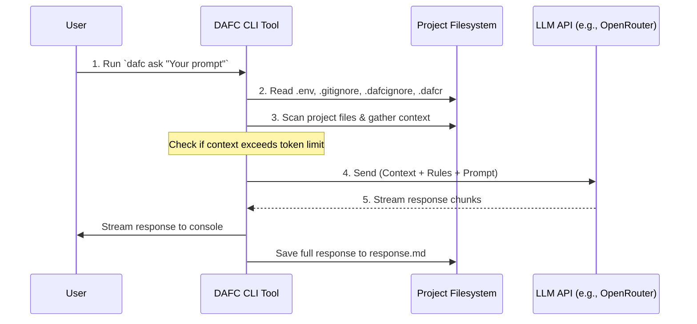

Okay, here is a Mermaid sequence diagram illustrating the basic workflow of the DAFC CLI tool when you use the `ask` command:

**Explanation of the Steps:**

1.  **User Input:** You execute the `dafc ask` command with your specific question or request in the terminal, within your project directory.
2.  **Configuration & Rules:** The DAFC CLI reads configuration from `.env` (like API keys) and ignore rules from `.gitignore` and `.dafcignore`. It also reads custom instructions for the LLM from `.dafcr` if it exists.
3.  **Context Gathering:** The CLI scans your project directory, reads the content of allowed files (respecting ignore rules and file size limits), estimates the total token count, and aborts if it exceeds the configured maximum (`MAX_CONTEXT_TOKENS`).
4.  **LLM Request:** The CLI formats the gathered file content, the rules from `.dafcr`, and your prompt into a request and sends it to the configured Large Language Model API endpoint.
5.  **Response Handling:** The LLM API streams its response back. The DAFC CLI prints this response directly to your console as it arrives and simultaneously saves the complete response to the `response.md` file in your project directory.